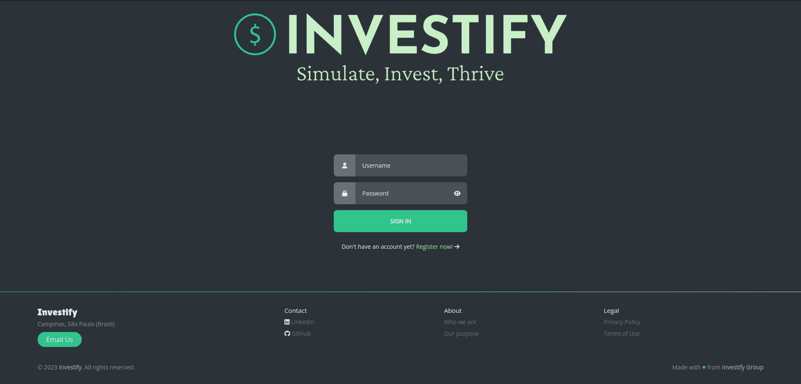
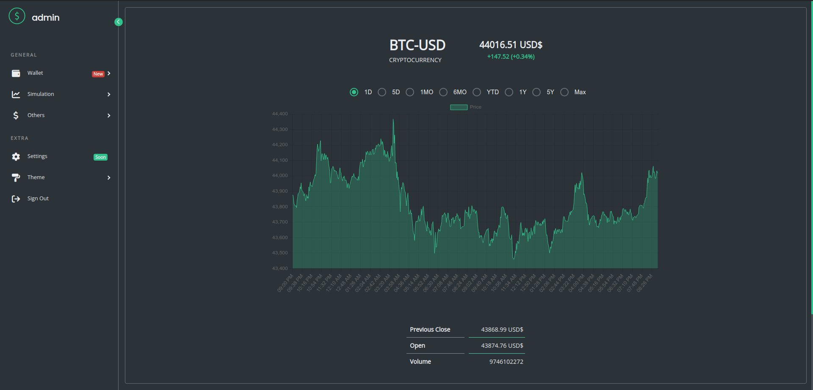
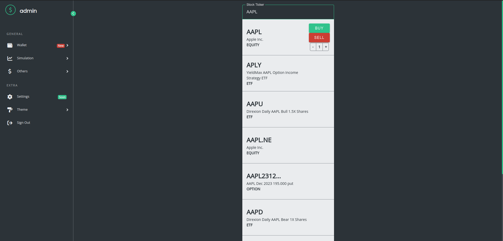
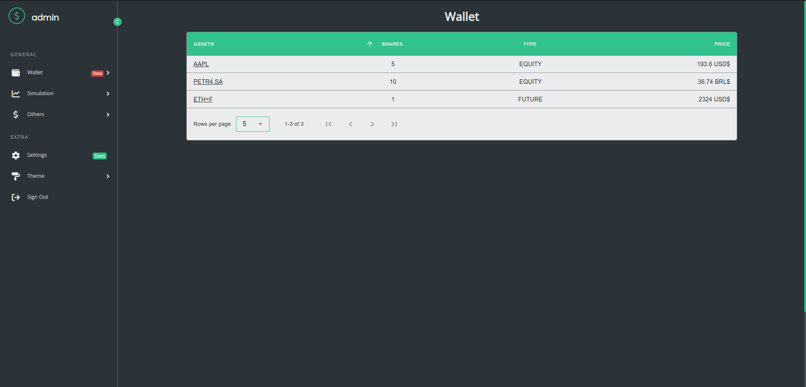
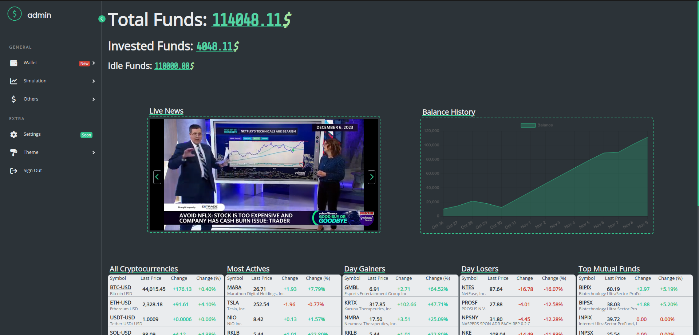

<div align="center">
  
</div>

---

<div align="center">

  ### Tech Stack and Tools

  
  
  

  
  
  
  

  
  
  
  
  

</div>

<details>
  <summary>Table of Contents</summary>
  <ol>
    <li>
      <a href="#overview">Overview</a>
    </li>
    <li>
      <a href="#features">Features</a>
    </li>
    <li>
      <a href="#installation">Installation</a>
    </li>
    <li>
      <a href="#usage">Usage</a>
    </li>
    <li>
      <a href="#license">License</a>
    </li>
    <li>
      <a href="#documentation">Documentation</a>
      <ul>
        <li><a href="#server-side-technologies">Server-Side Technologies</a></li>
        <li><a href="#client-side-technologies">Client-Side Technologies</a></li>
        <li><a href="#other-technologies">Other Technologies</a></li>
        <li><a href="#development-process">Development Process</a></li>
        <li><a href="#development-structure">Development Structure</a></li>
        <li><a href="#development-information">Development Information</a></li>
        <li><a href="#development-tools">Development Tools</a></li>
      </ul>
    </li>
  </ol>
</details>

## Overview

This repository contains the code and documentation of the Investify app. The app is designed to provide users with a realistic platform for simulating stock trading and managing investment portfolios. It offers a range of features to help users make informed investment decisions.

## Features

- **Stock Simulation**: Users can buy and sell stocks at current market prices, with access to historical and real-time market data.

- **Portfolio Tracking**: Users can create and manage investment portfolios, track performance, and view historical data.

- **Investment Analysis**: The app provides tools for risk assessment, portfolio diversification, and investment performance evaluation.

- **User Authentication**: Secure user accounts with authentication and authorization features.

- **News and Insights**: Integration of financial news and market insights to keep users informed.

- **Notifications and Alerts**: Real-time notifications for market events and portfolio updates.

- **Multi-Platform Access**: Cross-platform compatibility for web browsers, smartphones, and tablets.

## Installation

1. Clone the repository.

```bash
git clone https://github.com/pedrodcarvalho/investify.git
```

2. Install dependencies.

```bash
npm install
```

3. Database setup.

For local run, create a `.env` file in the root directory and add the following environment variables.

```bash
HOSTNAME=localhost
PORT=5000
MONGO_URI=<your-mongodb-uri>
SESSION_SECRET=<your-session-secret>
```

You will need to create a MongoDB database. For this, please refer to the [MongoDB documentation](https://docs.mongodb.com/manual/installation/).

## Usage

To run the app locally, simply use the following command.

```bash
npm start
```

## License

This project is licensed under the MIT License. See the [LICENSE](LICENSE) file for details.

## Documentation



**User Authentication**: Users can create accounts and log in to the app.

<br>
<br>
<br>



**Quote Search**: Users can search for stocks and view historical and real-time market data.

<br>
<br>
<br>



**Stock Simulation**: Users can buy and sell stocks at current market prices.

<br>
<br>
<br>



**Portfolio Tracking**: Users can manage investment portfolios.

<br>
<br>
<br>



**Investment Analysis**: Users can view portfolio performance and historical data.

**News and Insights**: Users can view financial news and market insights.

**Notifications and Alerts**: Users can receive real-time notifications of the real time stock market.

**Multi-Platform Access**: Users can access the app on web browsers, smartphones, and tablets.

### Server-Side Technologies

- **Node.js**: Runtime environment to execute server-side JavaScript code.

- **Express.js**: Node.js framework for building robust web applications and RESTful APIs.

- **Database**: MongoDB for storing user data and investment information.

### Client-Side Technologies

- **HTML/CSS/JavaScript**: Core web technologies for the user interface.

### Other Technologies

- **RESTful API**: To handle client-server communication.

- **Financial Data**: Integration with Yahoo Finance's APIs.

- **News Integration**: YouTube's APIs for live financial news.

- **Data Visualization**: Chart.js for interactive graphs.

## Development Process

The project was developed using an agile approach, with a focus on flexibility and adaptability. The development process was divided into 14 sprints. The project was managed using Trello for task management with a Kanban template for agile development and GitHub for version control.

Please refer to the [project board](https://trello.com/b/8WpMEZXD/investify) for more details.

## Development Structure

1. **Clear Project Goals**: Understand user needs and outline project goals.

2. **Agile Development**: Adopt an agile approach for flexibility and adaptability.

3. **Testing and Security**: Implement robust testing and prioritize security.

4. **Scalability and Performance**: Design for scalability and optimize performance.

5. **Documentation and Support**: Provide user-friendly documentation and support channels.

## Development Information

- **Timeline**: 4 months development plan with milestones.

- **Learning**: Continuously enhance skills through online resources.

- **Risk Assessment**: Proactively identify and mitigate potential challenges.

- **User Interface**: Prioritize an intuitive and user-friendly design.

- **Scalability**: Plan for future growth and user scalability.

- **Individual Development**: Solo development with Git version control and project management tools.

- **User Feedback**: Incorporate user testing and feedback.

## Development Tools

- **Version Control**: Git.

- **Code Repository**: GitHub.

- **Code Editor**: Visual Studio Code.

- **Project Management**: Trello.

---
